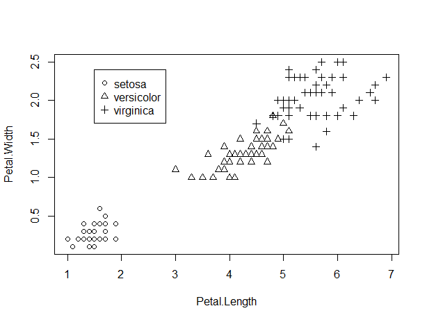

# 第二步：数据分析
## 2.Descriptive statistics
### 多组散点图
```R
f <- factor(iris$Speices)
with(iris, plot(Petal.Length, Petal.Width, pch = as.interger(f)))
legend(1.5, 2.4, as.character(levels(f)), pch=1:length(levels(f)))
gird()#绘制网格
```


## 3.Inferencial statistics
### 3.1 t test
### 3.2 The Analysis of Variance
One-way ANOVA
```R
attach(iris)
names(iris)
aggregate(Sepal.Length, by=list(Species), FUN=mean)
aggregate(Sepal.Length, by=list(Species), FUN=sd)
fit <- aov(Sepal.Length ~ Species)
summary(fit)
detach(iris)
```
### 3.3 Cluster analysis

```R
#导入数据，并将数据中转换为矩阵
data=iris[,-5]
dist.e=dist(data,method='euclidean')
# 热力图
heatmap(as.matrix(dist.e),labRow = F, labCol = F)
#聚类 并将结果限制为3类
model1=hclust(dist.e,method='ward')
result=cutree(model1,k=3)
#使用MDS降维
mds=cmdscale(dist.e,k=2,eig=T)
x = mds$points[,1]
y = mds$points[,2]
#通过ggplot2可视化的表现出来
library(ggplot2)
p=ggplot(data.frame(x,y),aes(x,y))
p+geom_point(size=3,alpha=0.8,
             aes(colour=factor(result),
               shape=iris$Species))

```
另外一个例子
```R
#案例:对multcomp包中的怀孕小鼠数据做聚类

library(multcomp)
#先通过图表了解数据集的分布
library(ggplot2)
data(litter, package="multcomp" )
#不同剂量组别的小鼠，产出的幼崽体重分布
ggplot(data = litter, package="multcomp",
       aes(x=weight, fill=dose)) +
  geom_density(alpha=.3) 
#不同剂量组别的小鼠，产出的幼崽个数分布
ggplot(data = litter, package="multcomp",
       aes(x=number, fill=dose)) +
  geom_density(alpha=.5) 
#表示协变量
ggplot(data = litter, 
       aes(x=number, fill=dose)) +
  geom_density(alpha=.5) +
  facet_grid(.~gesttime)
#散点图
ggplot(data = litter, package = "multcomp", 
       aes(x=number, y = weight, 
           colour = factor(dose))) +
  geom_point() 

### 对小鼠进行聚类
# step1: 选择合适的变量
mouse <- litter[,-1]
# step2: 对数据进行标准化/转化
z <- scale(mouse)
# step3:寻找异常点

#step4: 计算距离
d <- dist(z)

#step5:选择聚类方法
fit.average <- hclust(d, method = "average")
plot(fit.average, hang =-1, cex=.8, main = "AVERAGE LINKAGE CLUSTERING")
rect.hclust(fit.average, k=4) # 在图上将聚类结果框起来

#step6:确定类的数目
clusters <- cutree(fit.average, k=4)
table(clusters) # 查看每类里面有多少观测值
aggregate(mouse, by=list(cluster=clusters), median) #描述聚类
aggregate(as.data.frame(z), by=list(cluster=clusters), median) #描述聚类

#step7:尝试多种聚类方法,并确定最终的聚类方法
fit.single <- hclust(d, method = "single")
plot(fit.single, hang =-1, cex=.8, main = "Single LINKAGE CLUSTERING")

fit.complete <- hclust(d, method = "complete")
plot(fit.complete, hang =-1, cex=.8, main = "complete LINKAGE CLUSTERING")

fit.ward <- hclust(d, method = "ward")
plot(fit.ward, hang =-1, cex=.8, main = "ward LINKAGE CLUSTERING")
clusters.ward <- cutree(fit.ward, k=3)

#step8:结果的可视化
#使用MDS降维
mds=cmdscale(d,k=2,eig=T)
x = mds$points[,1]
y = mds$points[,2]
#通过ggplot2可视化的表现出来
library(ggplot2)
p=ggplot(data.frame(x,y),aes(x,y))
p+geom_point(size=3,alpha=0.8,
             aes(colour=factor(clusters),
                 shape=litter$dose))
#ward法
p=ggplot(data.frame(x,y),aes(x,y))
p+geom_point(size=3,alpha=0.8,
             aes(colour=factor(clusters.ward),
                 shape=factor(litter$gesttime))
             )
```
