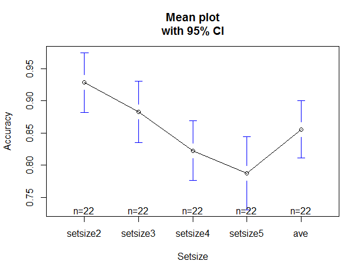

> 毕设实验
----

# 1.实验一
控制setsize考察工作记忆容量
```R
# 数据导入
expdata <- read.table("exp1data.csv", header = TRUE, sep = ",")
# 删除不需要的变量
newdata <- expdata[c(-7)]
# 原始数据是长数据，现在需要计算每个被试在各setsize下的正确率
subdata <- newdata[c("Sub", "Trial", "Setsize","Acc")]
accdata <- dcast(subdata, Sub~Setsize, mean)
# 对变量进行重命名
names(accdata)[2:5] <- c("setsize2", "setsize3", "setsize4", "setsize5")
# 按行（被试）计算平均值
accdata$ave <- apply(accdata[,2:5],1,mean)
# 把accdata 融合melt成长型数据
md = melt(accdata, id=c("Sub"))
# 通过箱线图表现不同setsize水平下，被试的正确率分布
with(md,boxplot(value ~ variable, main = "Accuracy Under Each Setsize", xlab = "Setsize", ylab = "Accuracy"))
# 单因素方差分析
with(md, aggregate(value, by=list(variable), FUN=mean))
fit <- with(md,aov(value ~ variable))
summary(fit)
library(gplots)
with(md,plotmeans(value ~ variable, xlab = "Setsize", ylab = "Accuracy", main="Mean plot\nwith 95% CI"))
```

